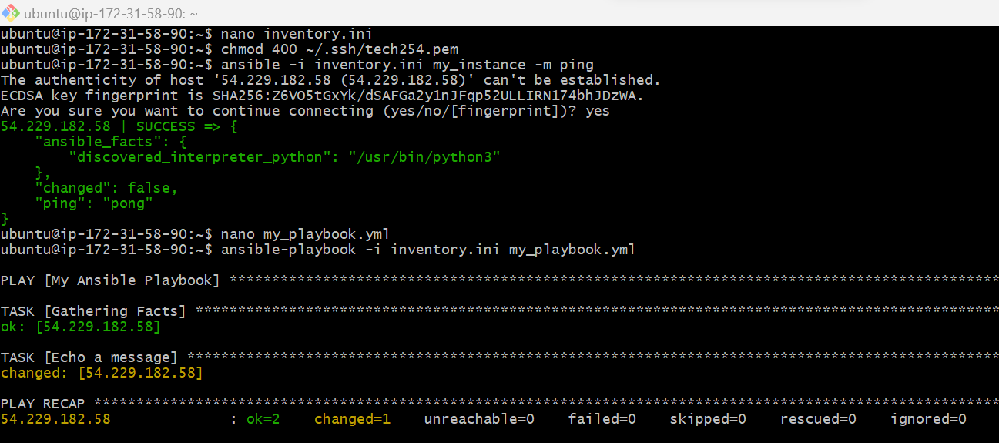

### Ansible

### What is Ansible?

- Ansible is an open-source automation tool used for configuring and managing computers, networks, and other systems. 

- It falls under the category of configuration management and application deployment tools.

- Ansible automates tasks such as application deployment, cloud provisioning, configuration management, and workflow automation.

### Installing Ansible 

Step 1: Launch an EC2 instance 

Step 2: SSH into GitBash terminal 

Step 3: Run the following commands

```
# update/upgrade packages
Sudo apt update
Sudo apt upgrade 
sudo apt install software-properties-common
sudo apt-add-repository ppa:ansible/ansible
sudo apt update -y
```
```
# Install Ansible
sudo apt install ansible -y
```
```
# Navigating into ansible file
 cd /etc/ansible/
```
```
# Installing tree to see a list of files clearly
sudo apt install tree -y
tree
```
```
# Navigating into .ssh folder
cd ~/.ssh
```

### Copying the pem file (SCP method)

1. Open a new GitBash terminal 

```
scp -i "~/.ssh/tech254.pem" ~/.ssh/tech254.pem ubuntu@<Insert public DNS>:~/.ssh
```

2. Check if pem file is there

`cd ~/.ssh`
`ls`

### SSH into Target Instance from Ansible Controller 

```
nano inventory.ini

# inventory.ini
[my_instance]
34.245.20.82 ansible_ssh_private_key_file=~/.ssh/tech254.pem ansible_ssh_user=ubuntu

chmod 400 ~/.ssh/tech254.pem

ansible -i inventory.ini my_instance -m ping

nano my_playbook.yml

---
- name: My Ansible Playbook
  hosts: my_instance
  tasks:
    - name: Echo a message
      command: echo "Hello, Ansible!"

ansible-playbook -i inventory.ini my_playbook.yml

```
