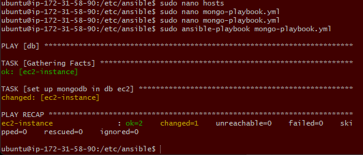

### What are playbooks?

- A playbook is a configuration file written in YAML (YAML Ain't Markup Language). 

- Ansible playbooks are used to define a set of tasks, configurations, and policies that can be applied to managed nodes (servers or network devices).

- Playbooks allow you to automate tasks, perform configuration management, and deploy applications in a systematic and repeatable way.

### Deploying a playbook

`sudo ansible-playbook filename.yml`

### Ad-Hoc commands

Checking the operating system:

`sudo ansible web -a "uname -a`

Checking the status of a program: 

`sudo ansible web -a "sudo systemctl status nginx`

### Creating playbooks - Installing Ngnix

**Step 1:** Create a script to install nginx

`sudo nano install-nginx.yml`

**Step 2:** Script

- **Indentation in yaml use 2 spaces not tab**
- Yaml files require `---` at the start to be recognised as a yaml file

```
---
#starts with thee dashes
# where do you want to install or run this playbook
- hosts: web

# find the facts
  gather_facts: yes

# provide admin access to this playbook
  become: true

# provide the actual instructions - instal nginx
  tasks:
  - name: provision/install/configure Nginx
    apt: pkg=nginx state=present

# ensure nginx is running/enabled
```

**Step 3**: Run the script

`sudo ansible-playbook install-nginx.yml`

### Creating playbooks - Installing Nodejs

**Step 1:** Open text editor

`sudo nano install-nodejs.yml`

**Step 2:** Write out the script to install Nodejs

```
---
# where do you want to install or run this playbook
- hosts: web

# find the facts
  gather_facts: yes

# provide admin access to this playbook - use sudo
  become: true

# provide the actual instructions - install NodeJS
  tasks:
  - name: Install the NodeSource Node.js 12.x release PPA
    shell: "curl -sL https://deb.nodesource.com/setup_12.x | bash -"

  - name: Install Node.js
    apt: pkg=nodejs state=present

  - name: Check Node.js version
    shell: "node -v"
    register: node_version

  - name: Display Node.js version
    debug:
      msg: "Node.js version is {{ node_version.stdout }}"

  - name: Check NPM version
    shell: "npm -v"
    register: npm_version

  - name: Display NPM version
    debug:
      msg: "NPM version is {{ npm_version.stdout }}"
```


**Step 3:** Run the script

`sudo ansible-playbook install-nodejs.yml`


### Creating playbooks - Installing MongoDB

**Step 1:** Open text editor

`sudo nano mongo-playbook.yml`

**Step 2:** Enter the script

```
#this playbook is to set up mongodb in the db ec2

---

#agent node name/ip
- hosts: db

#gather facts
  gather_facts: yes
#provide admin access
  become: true
#provide instructions
  tasks:
  - name: set up mongodb in instance
    #shell:
    apt: pkg=mongodb state=present
#ensure db is running

```

**Step 3:** Run the script

`sudo ansible-playbook mongo-playbook.yml`

Expected outcome



**Checking the status of MongoDB**

`sudo ansible db -a "sudo systemctl status mongodb"`

### Creating a playbook to configure bind ip

**Step 1:** Open text editor

`sudo nano mongodb-config.yml`

**Step 2:** Enter the script and restart and enable the db after the change

```
---
- name: Configure MongoDB to Accept Requests
  hosts: db
  become: yes
  tasks:
    - name: Set bind IP to accept requests from all IPs
      lineinfile:
        path: /etc/mongodb.conf
        regexp: '^bindIp:'
        line: 'bindIp: 0.0.0.0'

    - name: Restart MongoDB Service
      service:
        name: mongodb
        state: restarted

    - name: Enable MongoDB Service on Boot
      service:
        name: mongodb
        enabled: yes
```

**Step 3**: Manually build the environment in the app instance

`export DB_HOST=mongodb://3.253.69.181:27017/posts`


