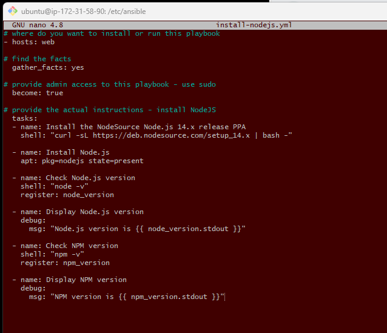
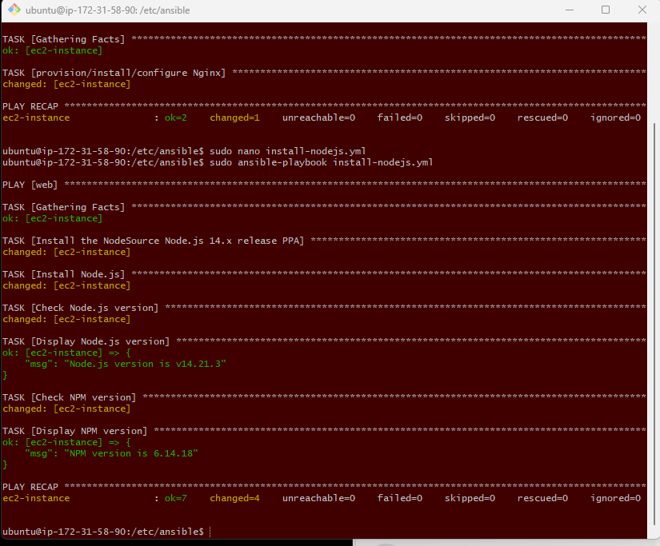

### What are playbooks?

- A playbook is a configuration file written in YAML (YAML Ain't Markup Language). 

- Ansible playbooks are used to define a set of tasks, configurations, and policies that can be applied to managed nodes (servers or network devices).

- Playbooks allow you to automate tasks, perform configuration management, and deploy applications in a systematic and repeatable way.

### Creating playbooks - Installing Ngnix

Step 1: Checking connection 

```
sudo ansible web -m ping

sudo nano hosts

[web]

ec2-instance ansible_host=52.210.154.251 ansible_user=ubuntu ansible_ssh_private_key_file=/home/ubuntu/.ssh/tech254.pem

```

Step 2: Create a script to install nginx

`sudo nano install-nginx.yml`

Step 3: Script

```
---
#starts with thee dashes
# where do you want to install or run this playbook
- hosts: web

# find the facts
  gather_facts: yes

# provide admin access to this playbook
  become: true

# provide the actual instructions - instal nginx
  tasks:
  - name: provision/install/configure Nginx
    apt: pkg=nginx state=present

# ensure nginx is running/enabled
```

Step 4: Run the script

`sudo ansible-playbook install-nginx.yml`

### Creating playbooks - Installing Nodejs

**Step 1:** Open text editor

`sudo nano install-nodejs.yml`

**Step 2:** Write out the script to install Nodejs

```
---
# where do you want to install or run this playbook
- hosts: web

# find the facts
  gather_facts: yes

# provide admin access to this playbook - use sudo
  become: true

# provide the actual instructions - install NodeJS
  tasks:
  - name: Install the NodeSource Node.js 12.x release PPA
    shell: "curl -sL https://deb.nodesource.com/setup_12.x | bash -"

  - name: Install Node.js
    apt: pkg=nodejs state=present

  - name: Check Node.js version
    shell: "node -v"
    register: node_version

  - name: Display Node.js version
    debug:
      msg: "Node.js version is {{ node_version.stdout }}"

  - name: Check NPM version
    shell: "npm -v"
    register: npm_version

  - name: Display NPM version
    debug:
      msg: "NPM version is {{ npm_version.stdout }}"
```



**Step 3:** Run the script

`sudo ansible-playbook install-nodejs.yml`


