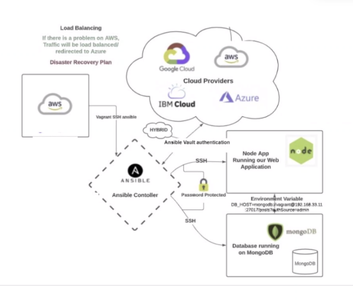

The diagram above displays a cloud infrastructure set up that uses Ansible for configuration management and orchestration. 

### What is infrastructure as a code?

Infrastructure as Code (IaC) refers to managing and provisioning computer data centers through machine-readable script files, rather than through physical hardware configuration or interactive configuration tools. 

- IaC allows you to define and manage your infrastructure using code. 

- With IaC, you can automate the process of setting up servers, networks, storage, and other infrastructure components. 

- Common IaC tools include Terraform, AWS CloudFormation, and Ansible.

### What is configuration management?

Configuration management involves managing and controlling software and hardware configurations across an organization's IT infrastructure. 

This includes ensuring that software versions are consistent, configurations are standardized, and changes are tracked and managed. 

Configuration management tools help automate these processes, ensuring that systems are in the desired state and that changes are documented and controlled.

### What is Orchestration?

Orchestration refers to the automated arrangement, coordination, and management of computer systems, middleware, and services. 

It involves integrating multiple systems and automating their processes to execute a specific workflow or task.

