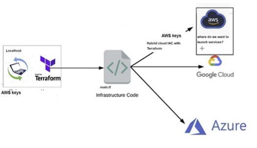
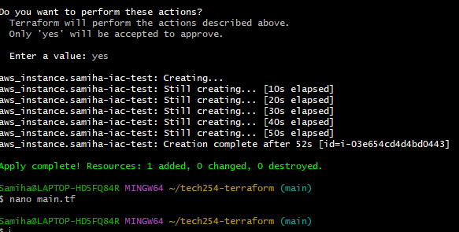
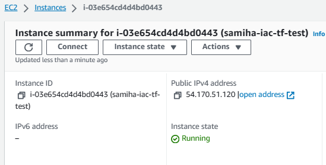

### Terraform

Using Terraform with AWS involves several steps to set up your infrastructure as code and manage your AWS resources. 



### Prerequisites:

1. Install Terraform:
- Download and install Terraform from the official website.
- Add the Terraform binary to your system's PATH.

2. AWS Account:
- Set up your AWS console
- Create an environment variable in windows. Use the link for a guide: https://kb.wisc.edu/cae/page.php?id=24500

### Steps to use Terraform with AWS

**Step 1:** Initialise a Terraform project
- Create a new directory <br>
`tech254-terraform`
- Inside the directory create a terraform file <br>
`nano main.tf`

**Step 2:** Configure AWS Provider
- in the main.tf file, configure the AWS provider with your AWS credentials, then Save. 

```
# Who is the cloud provider
provider "aws" {

# location of aws
  region = "eu-west-1"
}
# to download required dependencies

```

**Step 3:** Initialise Terraform 

`terraform init`

**Step 4:** Define AWS resources
- Navigate into your nano main.tf file and enter the AWS resources you would like to create, then Save.

```
# Who is the cloud provider
provider "aws" {


# location of aws
  region = "eu-west-1"
}
# to download required dependencies
# create a service/resource on the cloud - ec2 on aws

resource "aws_instance" "samiha-iac-test" {
   ami = "ami-0943382e114f188e8"
   instance_type = "t2.micro"
   tags = {
     Name = "samiha-iac-tf-test"
   }

}
```
**Step 5:** Plan your Infrastructure <br>

`terraform run`

**Step 6:** Apply changes <br>

`terraform apply`

**Expected output** 



**If you navigate to AWS EC2, you will see that an EC2 instance has been created.** 



**Step 7:** Delete resources created <br>

`terraform destroy`