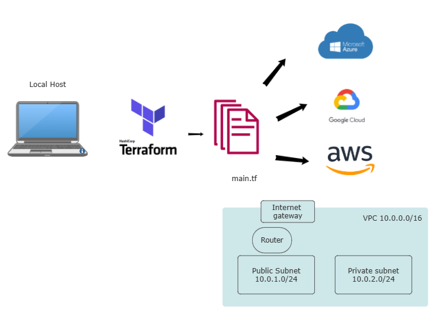
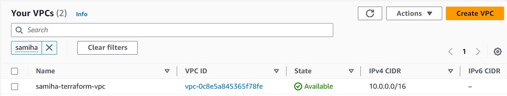

## VPC with Terraform



**Diagram explained:**

- Local host we have Terraform installed 
- Terraform is local, but we can use any cloud platform
- Terraform requires the correct access keys in order to launch resources in AWS

### Creating a VPC with Terraform

**Step 1:** Write Terraform Configuration Files
- Create a file named main.tf and add the following code to define your VPC configuration:

```

provider "aws" {
  region = var.aws-region #"eu-west-1"
}

resource "aws_vpc" "my_vpc" {
  cidr_block           = "10.0.0.0/16"
  enable_dns_support   = true
  enable_dns_hostnames = true

  tags = {
    Name = "samiha-terraform-vpc"
  }
}

resource "aws_subnet" "public_subnet" {
  vpc_id                  = aws_vpc.my_vpc.id
  cidr_block              = "10.0.1.0/24"
  availability_zone       = "${var.aws-region}a"
  map_public_ip_on_launch = true

  tags = {
    Name = "samiha-terraform-public-subnet"
  }
}

resource "aws_subnet" "private_subnet" {
  vpc_id            = aws_vpc.my_vpc.id
  cidr_block        = "10.0.2.0/24"
  availability_zone = "${var.aws-region}a"

  tags = {
    Name = "samiha-terraform-private-subnet"
  }
}

resource "aws_internet_gateway" "my_igw" {
  vpc_id = aws_vpc.my_vpc.id

  tags = {
    Name = "samiha-terraform-igw"
  }
}

resource "aws_route_table" "public_route_table" {
  vpc_id = aws_vpc.my_vpc.id

  route {
    cidr_block = "0.0.0.0/0"
    gateway_id = aws_internet_gateway.my_igw.id
  }

  tags = {
    Name = "samiha-terraform-public-route-table"
  }
}

resource "aws_route_table_association" "public_rta" {
  subnet_id      = aws_subnet.public_subnet.id
  route_table_id = aws_route_table.public_route_table.id
}

resource "aws_network_acl" "my_nacl" {
  vpc_id = aws_vpc.my_vpc.id

  egress {
    protocol   = "-1"
    rule_no    = 100
    action     = "allow"
    cidr_block = "0.0.0.0/0"
    from_port  = 0
    to_port    = 0
  }

  ingress {
    protocol   = "-1"
    rule_no    = 100
    action     = "allow"
    cidr_block = "0.0.0.0/0"
    from_port  = 0
    to_port    = 0
  }

  tags = {
    Name = "samiha-terraform-nacl"
  }
}

resource "aws_security_group" "my_sg" {
  vpc_id = aws_vpc.my_vpc.id

  ingress {
    description = "SSH"
    from_port   = 22
    to_port     = 22
    protocol    = "tcp"
    cidr_blocks = ["0.0.0.0/0"]
  }

  egress {
    from_port   = 0
    to_port     = 0
    protocol    = "-1"
    cidr_blocks = ["0.0.0.0/0"]
  }

  tags = {
    Name = "samiha-terraform-sg"
  }
}

```
**Step 2:** Initialize and Apply Terraform Configuration

`terraform init`

`terraform plan`

`terraform change`

**Successful output**



**Step 3:** Delete VPC 

`terraform destroy`

### Creating Security Groups for app & db

```
resource "aws_security_group" "app_sg" {
  vpc_id = aws_vpc.my_vpc.id

  ingress {
    description = "SSH"
    from_port   = 22
    to_port     = 22
    protocol    = "tcp"
    cidr_blocks = ["0.0.0.0/0"]
  }

  ingress {
    description = "Custom TCP Port 3000"
    from_port   = 3000
    to_port     = 3000
    protocol    = "tcp"
    cidr_blocks = ["0.0.0.0/0"]
  }

  ingress {
    description = "HTTP"
    from_port   = 80
    to_port     = 80
    protocol    = "tcp"
    cidr_blocks = ["0.0.0.0/0"]
  }

  egress {
    from_port   = 0
    to_port     = 0
    protocol    = "-1"
    cidr_blocks = ["0.0.0.0/0"]
  }

  tags = {
    Name = "samiha-terraform-app-sg"
  }
}

resource "aws_security_group" "db_sg" {
  vpc_id = aws_vpc.my_vpc.id

  ingress {
    description = "SSH"
    from_port   = 22
    to_port     = 22
    protocol    = "tcp"
    cidr_blocks = ["0.0.0.0/0"]
  }

  ingress {
    description = "Custom TCP Port 27017"
    from_port   = 27017
    to_port     = 27017
    protocol    = "tcp"
    cidr_blocks = ["0.0.0.0/0"]
  }

  egress {
    from_port   = 0
    to_port     = 0
    protocol    = "-1"
    cidr_blocks = ["0.0.0.0/0"]
  }

  tags = {
    Name = "samiha-terraform-db-sg"
  }
}
```